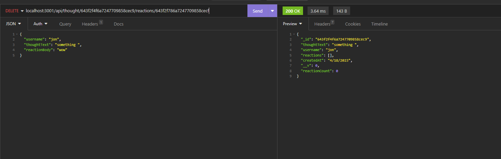
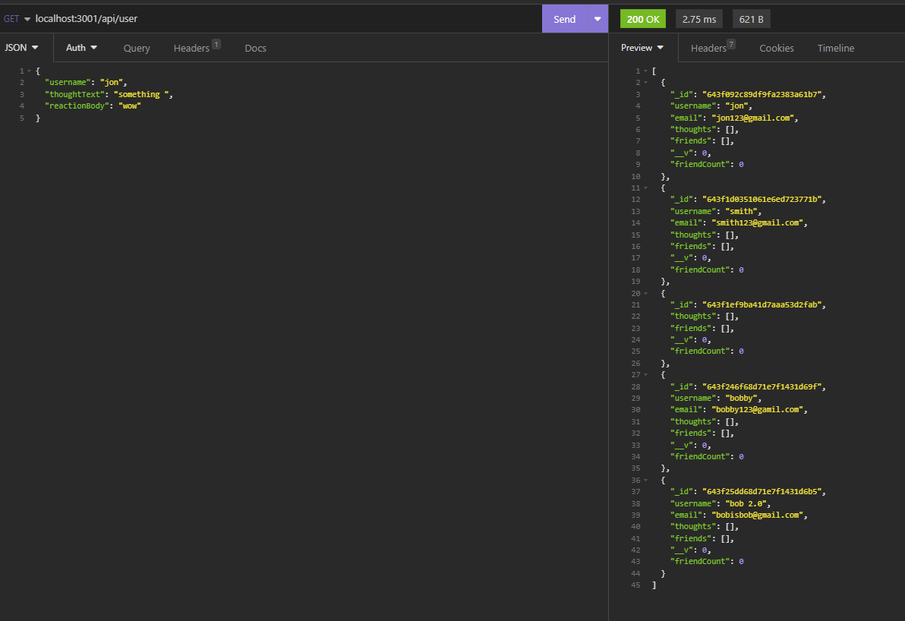

# social-network
A place to where you can comment, react, and add friends. You can also delete comments, reaction, and friends. Also you can update your info, and comments. 
## Summary
It's a social network app that isn't full fleshed out and you will have to use insomnia to be able to see everything, but you can add, delete, and update your comments. Add, delete, and update your account. Add and delete reactions and friends. 
## Table of Contents

- [Get user and thoughts](#Get-user-and-thoughts)
- [Get by id](#Get-by-id)
- [Post user and thought](#Post-user-and-thought)
- [Updating](#updating)
- [Links](#links)

### Get user and thoughts
This is getting the user and thought and showing the users and thoughts.

### Get by id
You can find a certain thought or user by their id.

### Post user and thought
You can post a user, thought, reaction, and friend.

### Updating
You can update your thought and user.

### Detele
You can detele user, thought, reaction, and friend.

### Links

https://drive.google.com/file/d/1XVSOavWdb4IDWQoEevS5d1I_o8IIGzHK/view

https://github.com/Quailll/social-network

